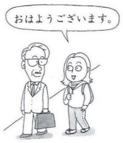

# 挨拶 (あいさつ)

||||
|-|-|-|
||||
|good morning|good morning (polite)|good afternoon|
||||
|good evening|goodbye|good night|
||||
|thank you|thank you (polite)|excuse/pardon me no/not at all|
||||
|I'll go and come back|Thank you for the meal(before eating)|how do you do/pleased to meet you|
||||
|please go and come back|Thank you for the meal(after eating)|||

**おはよう** and **ありがとう** are used casually while adding **ございます** is used formally. If you are on a first-name basis with someone, for for the shorter version. If you would address someone as Mr. or Mrs., use the longer version.

**さようなら** is used for the highest degree of separation; when the speaker does not expect to see them again.  
**じゃあ、また** is used between friends expecting to see each other again fairly soon (like classmates).  
**しつれいします** taking a leave from a professor's office for example. 
**いってきます** is used when leaving home but coming back soon.

**すみません** can mean (1) *"Excuse me"* to get another's attention, (2) *"Pardon me"*, to apologize for the trouble you caused, or (3) *"Thank you"* to show appreciation for what someone has done for you.

**いいえ** means *"No"*, a negative reply to a question. It can also be used to express "Don't mention it" or "You're welcome", which you point out that one is not required to feel obliged for what you've done for them.

**いってらっしゃい** literally means *"I will go and come back"*. 
**いってきます** which means *"Please go and come back"*. 
These are common exchange used at home when a family member leaves but is expected to come back.

**ただいま** means *"I am home right now"*. 
**おかえり** means *"Welcome home"* 

