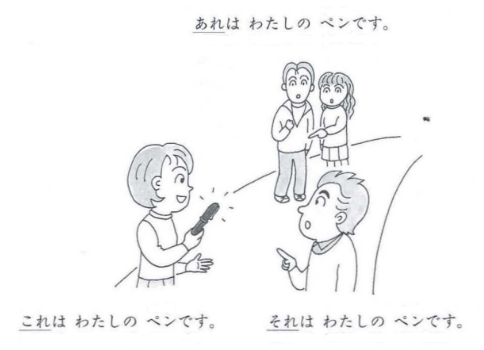

# これ、それ、あれ

When we talk about things we don't know the name of, we use "this", "that", or "that one over there" and so forth. Respectively, those translate to これ、それ and あれ。

これはいくらですか。 How much is this? 

それは三千円です。 That is 3,000 yen

||
|-|

**これ** refers to the thing that is close to you.**それ** refers to the thing that is closer to the person you're talking to.**あれ** refers to the thing that is neither close to you or the person spoken to ("that one over there"). どれ is an expression for "which".

どれですか。 Which one is it?

どれがあなたのペンですか。 Which one is your pen?

Question words like どれ and なに have a slight complication; they cannot be followed by the particle は. Instead you must use the particle が. 

## この/その/あの/どの + noun

If you want to be more specific than "this thing" or "that thing", you are going to use these words.

|～れ|～の|
|-|-|
|<u>これは</u>いくらですか。 How much is <u>this</u>?|<u>このとけいは</u>いくらですか。 How much is <u>this watch</u>?|
|**それは**三千円です。 **That's** 3000 yen.|**そのとけいは**三千円です **That watch** is 3000 yen.|
|**あれは**三千五百円です。 **That (over there)** is 3500 yen.|**あのとけいは**三千五百円です。 **That watch (over there)** is 3500 yen.|

If, for example, you know that one of several watches is 3,500 yen but don't know which, you can say:

**どのとけいが**三千五百円ですか。 **Which watch** is 3500 yen?

> since どの　is a question word, we cannot use は instead we use が.

## だれの noun

What if we want to ask to whom something belongs to? We use **だれの** like:

|||
|-|-|
|これは<u>だれの</u>かばんですか。 Whose bag is this?|それはスーさんのかばん。 That is Sue's bag.|

