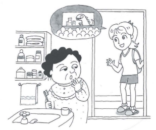

# Making a date

**たけし：**　メアリーさん、週末はたいてい何をしますか。 Mary, what do you usually do on the weekend? 
**メアリー：** そうですね。たいていうちで勉強します。でも、ときどき映画を見ます。  Let's see. I usually study at home. But I sometimes see movies. 
**たけし：** そうですか。。。じゃあ、土曜日に映画を見ませんか。
 I see... then, would you like to see a movie on Saturday? 
**メアリー：**　土曜日はちょっと。。。
 lit. Saturday is a little bit (inconvenient) 
**たけし：** じゃあ、日曜日はどうですか。
 Then, how about Sunday? 
**メアリー：** いいですね。
 That's fine.
 ・*On a Sunday morning, at Mary's home*・ 

||
|-|

**メアリー：** おはようございます。
 Good morning. 
**お母さん：** おはよう。早いですね。
 Good morning. You're early, aren't you. 
**メアリー：** ええ、今日は京都に行きます。京都で映画を見ます。
 Yes, I'm going to Kyoto today. I'm going to see a movie in Kyoto. 
**お母さん：** いいですね。何時ごろ帰りますか。
 Good. Around what time will you come back? 
**メアリー：** 九時ごろです。
 Around 9. 
**お母さん：**　晩ご飯は？
 How about dinner? 
**メアリー：** 食べません。
 I will not eat. 
**お母さん：** そうですか。じゃあ、いってらっしゃい。
 I see. Well, have a nice day. 
**メアリー：** いってきます。
 I will go now. 

