# Kanji

#### resources
- Genki Plus. Kanji Look and Learn
- [takoboto](https://takoboto.jp/)
- [app.kanjialive](https://app.kanjialive.com/)

### How many?
There are chinese dictionaries that list roughly 50,000 characters, but most of them have fallen out of common use. Japanese newspapers and magazines use about 3,000. Out of those, 1,945 were designated by the Japanese government as commonly used kanji; the Jouyo Kanji. A total of 1,006 of that are taught in elementary school; refered as the Kyouiku Kanji, and most of the remainder are taught in junior high. Nearly 99% of the kanji appearing in newspapers and magazines are Jouyo Kanji. The 500 most frequently used kanji account for almost 80% of all the newspaper kanji.

### How were they made 

#### 1. Pictograms
|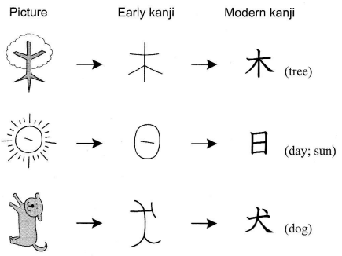|
|-|

#### 2. Simple ideograms

use dots and lines to represent numbers and abstract concepts that would be difficult to depict with pictograms.

|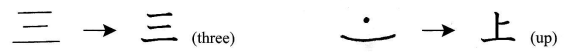|
|-|

#### 3. Compound ideograms
kanji formed frm the combination of two or more kanji.
|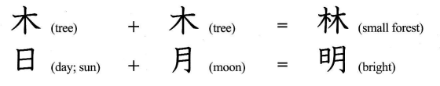|
|-|

#### 4. Phonetic-ideographic characters
made up of an element that expresses meaning and an element that represents a sound. It is said that 80% of the kanji used today fall into this category
|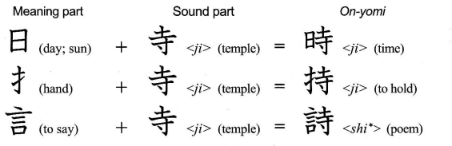|
|-|

 

## Radicals

upon closer insection of even the most complex kanji reveals taht they are made up of several simpler parts. Majority of the kanji are combinations of various subunits.  The part that is closely tied to the character's meaning is called a **radical**. Depending on their position within a kanji, the radicals are classified into the seven categories. 

|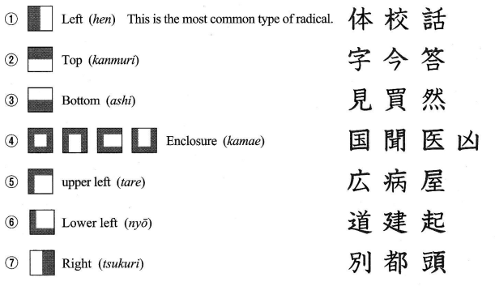|
|-|

### Kanji Readings

**Onyomi** are readings are derived from the Chinese pronunciations in the distant past. The reason why certain kanji have multiple *On-yomi* is that temporal and regional variances in the Chinese pronunciation were imported along with the characters. **人** for example are **ニン** which was the initially introduced and **ジン** which was adopted in a later era.

**Kun-yomi**; when Chinese characters were transplanted ot Japan, they were read with only the Chinese pronounciations at first. Later on, the Japanese started using kanji for writing native Japanese words corresponding to the character's meaning, marking the birth of the *kun-yomi*. Example: **人** means "person", so it came to also be read as **ひと**, the corresponding Japanese word.

### Writing

Yes, there is a proper way to write kanji.

|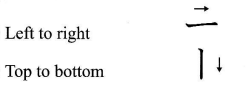|
|-|
|Horizontal strokes are written from **left to right**, Vertical strokes are written from **top to bottom**.|

|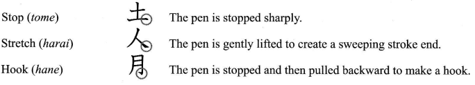|
|-|

|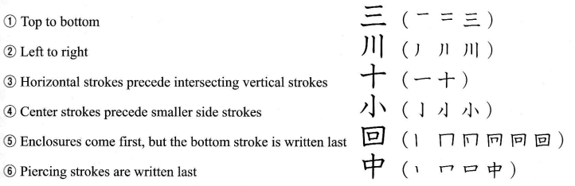|
|-|

### font-based variations
|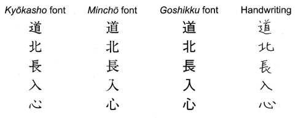|
|-|

#### Orikugana

Adjectives, verbs, and other conjugated words are written with kanji and hiragana. The hiragana portion is called *okurigana*. Example: the okurigana of 食べます is べます. When learning kanji, you need to pay attention to the extent of their readins, such as whether　食is read as た　or たべ. This needs to be kept in mind for each kanji, since the extent of the okurigana portion of conjugated words varies:

|動詞 (verb)|形容詞(adjective)|
|-|-|
|**行**く **行**かない|**大**きい **大**きくない|
|**食**べる **食**べない|**長**い **長**くない|

### Kanji Parts

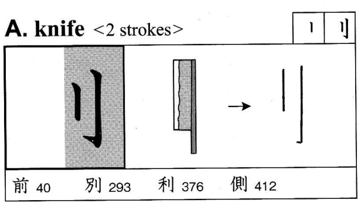 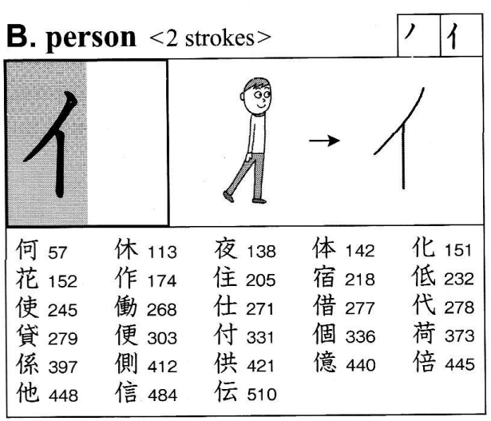 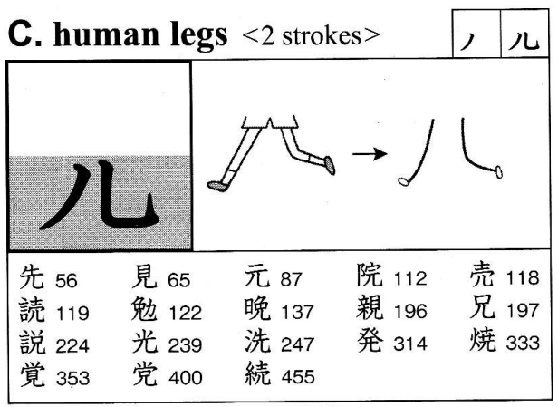

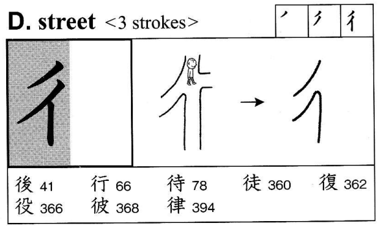 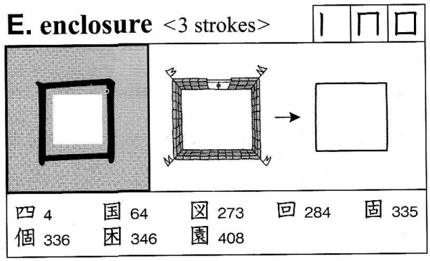 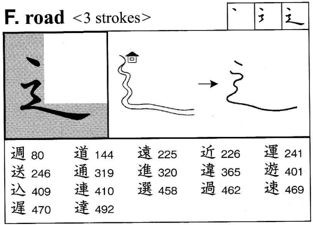

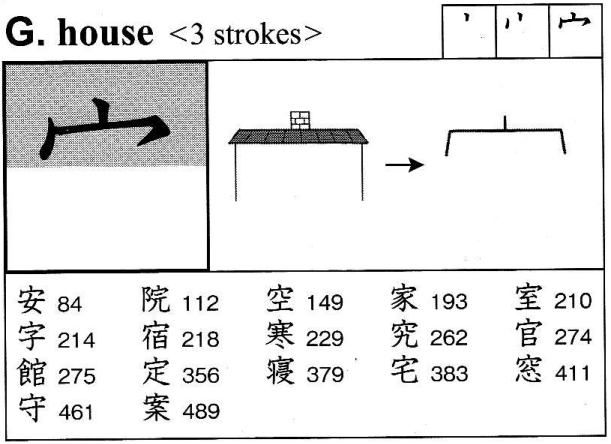 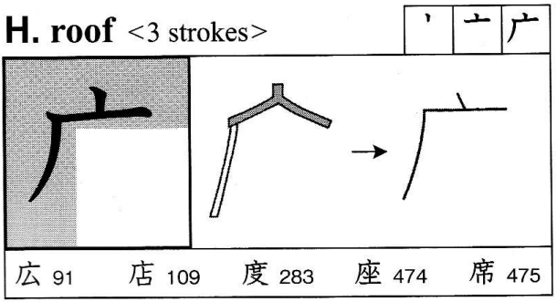 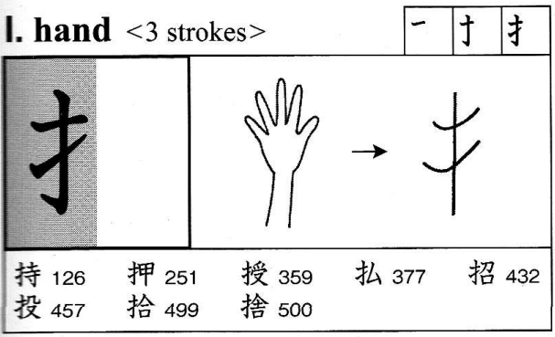 

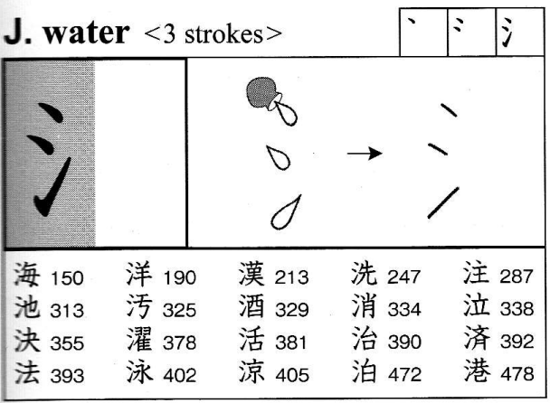 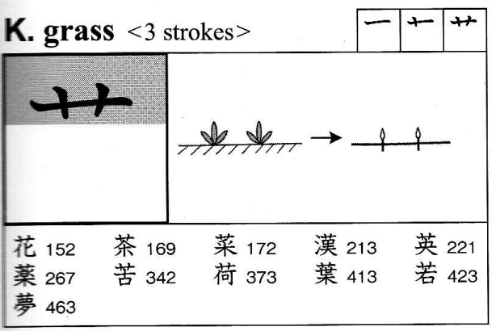 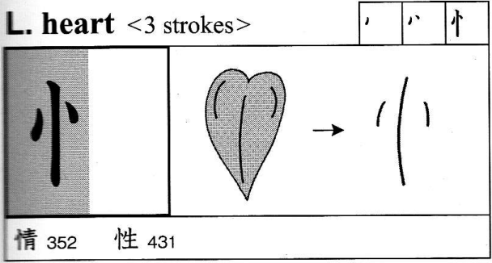

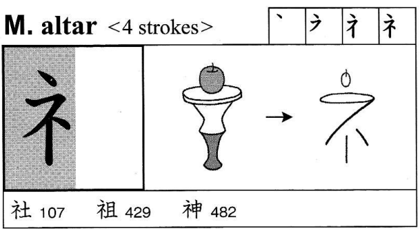 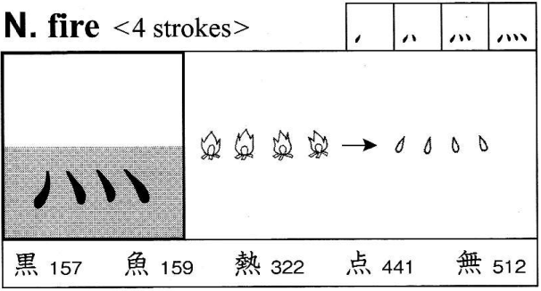 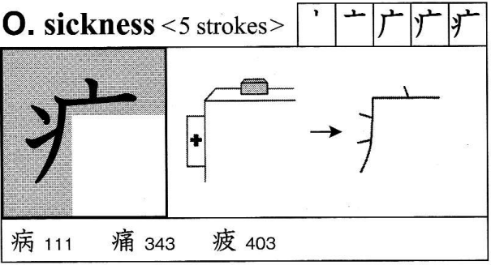

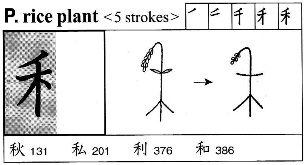
